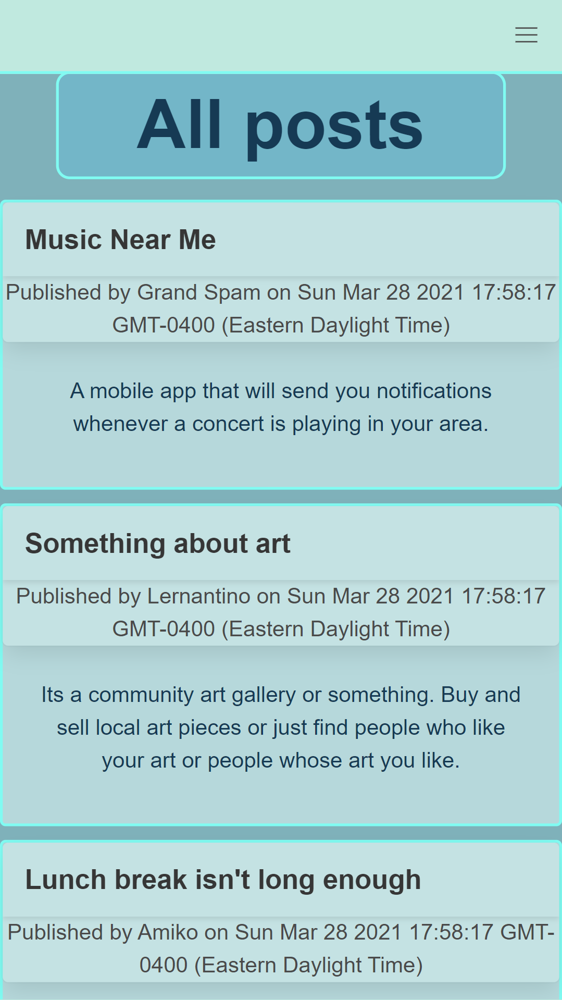

# Blog Project

This is a practice application on full-stack web development. Created using Node.js, Express.js, MySQL2, Sequelize, Auth0, and Handlebars. First, all visitors are presented with the homepage where all posts are displayed. If the user clicks the header of a post, they are transported to the post page where they can view all of the post's comments. Attempting to access the Dashboard page will result in the user being prompted to log in via Auth0. Once the user is logged in, they can create posts via the dashboard. Here they can also edit and delete any posts created by them. In the post's page, logged in users will be shown the option to leave a comment.

## Table of Contents
* [Usage](#usage)
* [Contributors](#contributors)
* [Questions](#questions)
* [License](#license)

# Usage
Currently broken... Could not set up properly to Heroku...
To use the application, view the deployed application on [Heroku here](https://limitless-mountain-67002.herokuapp.com/).

# Contributors
Thanks to the following people who have contributed to this project:

* [Scott Byer](https://github.com/switch120) 
* [Mike Fearly](https://michaelfearnley.com/)
* UNH Full Stack Development Bootcamp

# Questions
You can find me at my [github page here](https://github.com/ejhuang2015).
Any comments, questions, or concerns? Email me  at ejhuang.2015@gmail.com.

# License
### Copyright (c) [2021] [ejhuang2015]
View the license in [license.txt](./license.txt)
